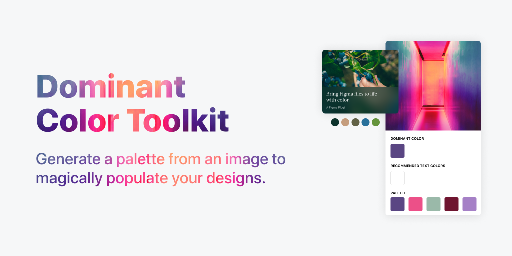

  

# Figma Dominant Color Toolkit 🎨

Generate a palette from an image to magically populate your designs.

[Install on Figma](https://www.figma.com/c/plugin/744725347356614754/Dominant-Color-Toolkit-%E2%9C%A8)

## Usage

This plugin provides two core functions:

1. **Generate utility palette**: extracts the dominant color from an image, suggests high-contrast text colors, and includes additional complementary palette information.
1. **Smart populate**: takes your selection and intelligently sets layer fills and text colors based on nearby images.

### Generating a dominant color palette

1. Select one or more layers in Figma that contain image fills. 
1. Run the plugin `Menu > Dominant Color Toolkit 🎨` and your palette will be generated. 

**Note:** To prevent overlapping frames from appearing in your designs, align your images 500px apart.

### Smart populate

1. Select any frame, component, or instance
2. Menu > Dominant Color Toolkit 🎨
3. Command + Shift + P to re-run

How does Smart Populate work?
- If you selected one or more frames which contain an image, shapes, and text, the plugin will use the first image it finds to automatically fill the shapes with the computed dominant color and set text layers to have a high-contrast fill against that dominant color.
- If you selected an image along with shapes and text layers, the plugin will use the selected image to populate selected shapes with the computed dominant color and set text layers to use the high-contrast fill color.
- If you selected shapes and text, but no image, the plugin will traverse outwards in your frame until it finds an image fill. This image will will then be used to populate the shapes and text with the dominant color and high-contrast text colors.

**Note:** This plugin supports both image fills and background fills, using the first valid fill it can find. As a result, a frame with a background fill that has children shape and text layers will populate successfully!

**Secret options:** If you'd like to text layers to the dominant color rather than high-contrast color, simply include the text "dominant" anywhere in the layer name!
 
## Installation and contributing

1. Clone the repository: `git clone https://github.com/brianlovin/figma-dominant-color-toolkit.git`
1. Go to the directory: `cd figma-dominant-color-toolkit`
1. Install dependencies with `npm install`
1. Build the plugin: `npm run dev`
1. Go to the `plugins` directory in Figma
1. Add a new development plugin
1. Select the `figma-dominant-color-toolkit/manifest.json` file as the manifest
